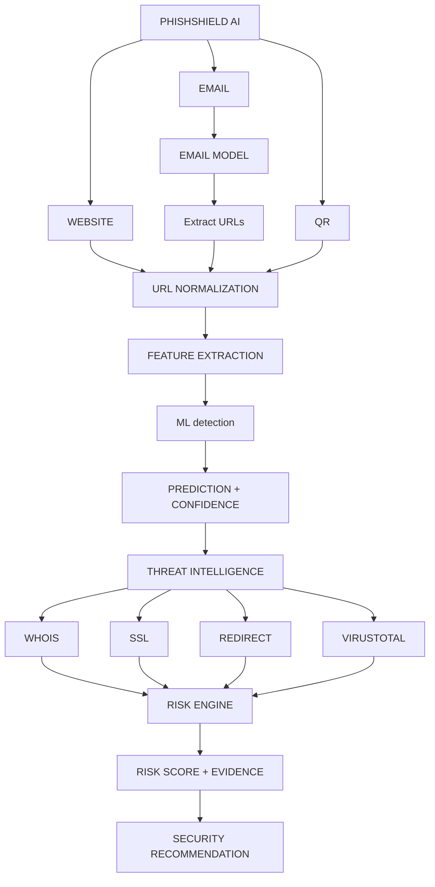

<div align="center">

# PhishShield AI
**Intelligent Phishing Detection & Security Analysis Platform**

[](https://reactjs.org/)
[](https://vitejs.dev/)
[](https://tailwindcss.com/)
[](https://www.python.org/)
[](https://fastapi.tiangolo.com/)
[](https://scikit-learn.org/)
[](https://xgboost.ai/)
[](https://www.tensorflow.org/)
[](https://developer.mozilla.org/en-US/docs/Web/JavaScript)
[](https://developer.chrome.com/docs/extensions/mv3/)

</div>

## 🚀 Live Demo

- **[PhishShield AI Web Platform](https://phishshieldai-xi.vercel.app/)**
- 🌐 **Frontend:** Deployed on **Vercel**
- ⚙️ **Backend:** Deployed on **Render**

---

## 📖 1. Project Introduction

PhishShield AI is an intelligent security-analysis platform designed for high-accuracy phishing detection. By combining advanced Machine Learning models, deterministic threat intelligence, and security forensics, the system delivers highly accurate and explainable results.

It supports:
- URL phishing detection
- Email phishing detection
- QR-based analysis
- Threat intelligence (VirusTotal, WHOIS, SSL)
- Security forensics (Hidden iframes, redirects, etc.)
- Explainable security results
- Browser-based URL scanning

---

## ✨ 2. Key Features

- 🤖 **AI/ML-based URL phishing detection**
- 📧 **Email phishing detection**
- 🔗 **URL extraction from emails**
- 🧠 **Combined email + URL risk intelligence**
- ⚠️ **Deterministic risk scoring**
- 🔍 **Email forensic analysis**
- 💡 **Explainable "Why This Result?" analysis**
- 🛡️ **Unified Security Report**
- 🌐 **WHOIS intelligence**
- 🔐 **SSL/TLS analysis**
- 🔄 **Redirect analysis**
- 🦠 **VirusTotal threat intelligence**
- 📱 **QR scanner**
- 🧩 **URL browser extension**
- 🖥️ **Responsive web dashboard**

---

## 🏗️ 3. System Architecture



---

## 🤖 4. URL Detection

The URL phishing detection pipeline relies on extracting **47 distinct features** from target URLs, including lexical, structural, and network-level properties.

- **XGBoost Classifier**: The primary ML engine uses an XGBoost-based prediction model (`xgboost_frozen.pkl`).
- **Random Forest Comparison**: Evaluated alongside XGBoost, an optimized Random Forest model demonstrated comparable high performance.
- The pipeline provides an ML prediction, a confidence score, a deterministic risk score, threat intelligence signals, and aggregates these into a final security verdict.

---

## 5. Email Detection

The platform provides an email phishing detection pipeline:

- **Email Input → Email Preprocessing → ML Email Detection → Email Prediction**
- **Linear SVM** is the production email detection model.
- **BiLSTM** was evaluated as an experimental deep-learning model.
- URLs are automatically **extracted from the email body**.
- Extracted URLs are **normalized** and passed to the existing **URL Analysis pipeline**.
- The URL analysis performs **Feature Extraction, ML-based URL Detection, WHOIS, SSL, Redirect and VirusTotal analysis**.
- Results from multiple URLs are combined using **Risk Aggregation** to generate an overall email risk assessment.

---

## 🔍 6. Security Intelligence

PhishShield AI enhances ML predictions with deterministic security intelligence:
- **WHOIS**: Analyzes domain age and registration anomalies.
- **SSL Certificate Validation**: Checks for missing, invalid, or suspicious TLS/SSL certificates.
- **Redirect Tracking**: Detects suspicious redirection chains and obfuscation tactics.
- **VirusTotal**: API integration to check against known malware and phishing engines.
- **Deterministic Risk Scoring**: Applies rigid penalty rules based on intelligence to adjust the final score.
- **Forensic Indicators**: Identifies hidden iframes, scripts, and embedded threats.
- **Explainability**: Clarifies exactly how these signals contribute to the final security analysis.

---

## ⚠️ 7. Risk Levels

The system combines available security signals (ML, Forensics, Intelligence) and maps them into clear risk levels:
- 🟢 **Very Safe**
- 🔵 **Safe**
- 🟡 **Suspicious**
- 🟠 **High Risk**
- 🔴 **Very High Risk**

*Note: The ML prediction is an isolated component; the final Risk Level is a unified result of all evidence combined by the Risk Engine.*

---

## 🛡️ 8. Unified Security Report

The final output is a structured `SecurityReport` encompassing these major evidence categories:
- **ML Evidence**: Confidence scores, probabilities, and raw predictions.
- **Forensic Evidence**: Hard indicators (e.g., hidden elements, zero-day domains).
- **URL Evidence**: Direct lexical and structural details from the URL.
- **Threat Intelligence**: Data from VirusTotal, WHOIS, and SSL validation.
- **Explainability**: Factors directly influencing the ML model's decision.
- **Verdict & Metadata**: The aggregated risk level, recommendations, and processing details.

---

## 🧩 9. Browser Extension

The PhishShield **URL Browser Extension** provides seamless protection in the browser:
- Built with **Chrome Manifest V3**.
- Automatically performs **active-tab URL capture**.
- Sends the URL securely to the local PhishShield backend for analysis.
- Displays a clean popup with the **prediction**, **confidence**, **risk score**, **risk level**, **recommendation**, and **threat/security signals**.
- Features safe handling of unsupported browser URLs (e.g., `chrome://`).

---

## 📂 10. Project Structure

```text
PhishShieldAI/
├── backend/
│   ├── api/
│   ├── config/
│   ├── debug/
│   ├── extractors/
│   ├── models/
│   ├── routes/
│   ├── schemas/
│   ├── services/
│   ├── tests/
│   └── utils/
├── checkpoints/
├── datasets/
├── extension/
├── frontend/
├── logs/
├── notebooks/
└── README.md
```

---

## 🔌 11. API Endpoints

- `POST /predict`
  - *Purpose*: Analyzes a target URL and returns a unified `SecurityReport`.
- `POST /api/analyze-email`
  - *Purpose*: Analyzes raw email text, extracts URLs, and returns a combined `SecurityReport`.
- `GET /health`
  - *Purpose*: Validates the operational status of the FastAPI backend.

---

## 📊 12. ML Performance

**URL Phishing Detection:**
| Rank | Model | Accuracy | Precision | Recall | F1-Score | ROC-AUC |
| :--- | :--- | :--- | :--- | :--- | :--- | :--- |
| 1 | **XGBoost** | **98.80%** | 98.16% | **99.47%** | **98.81%** | **99.95%** |
| 2 | **Random Forest** | 98.67% | **98.28%** | 99.07% | 98.67% | **99.95%** |
| 3 | MLP | 96.80% | 96.31% | 97.33% | 96.82% | 99.32% |
| 4 | **ResMLP** | 96.33% | 95.78% | 96.93% | 96.36% | 99.32% |
| 5 | Logistic Regression | 95.13% | 94.48% | 95.87% | 95.17% | 98.68% |

**Email Phishing Detection:**
| Model | Accuracy | Precision | Recall | F1 | ROC-AUC |
| :--- | :--- | :--- | :--- | :--- | :--- |
| Logistic Regression | 99.53% | 99.68% | 99.47% | 99.57% | 99.97% |
| Naive Bayes | 98.28% | 99.86% | 97.05% | 98.43% | 99.86% |
| **Linear SVM** | **99.76%** | **99.91%** | **99.65%** | **99.78%** | **100.00%** |
| **BiLSTM** | **99.65%** | **99.75%** | **99.63%** | **99.69%** | **99.98%** |

---

## 🚀 13. Setup & Usage

**1. Clone Repository:**
```bash
git clone https://github.com/Dileep0610/PhishShieldAI.git
cd PhishShieldAI
```

**2. Backend Setup:**
```bash
cd backend
python -m venv venv
# Windows: venv\Scripts\activate
# Mac/Linux: source venv/bin/activate
pip install -r requirements.txt
python -m uvicorn app:app --reload
```

**3. Frontend Setup:**
```bash
cd ../frontend
npm install
npm run dev
```

**4. Browser Extension:**
- Open Chrome and navigate to `chrome://extensions/`
- Enable "Developer mode" (top right)
- Click "Load unpacked" and select the `extension/` directory.

**Usage:**
- **Scan a URL:** Enter the URL in the main Web Dashboard input.
- **Analyze an Email:** Switch to the Email Analysis tab and paste the email text.
- **Use QR Scanner:** Click the QR scanner tab to decode a QR image.

---

## ⚠️ 14. Limitations

- Threat intelligence features (like VirusTotal) depend on external API availability and usage limits.
- The WHOIS intelligence module may occasionally be blocked by registrars limiting automated queries.

---

## 🔮 15. Future Scope

- **Email Browser Extension**: Integration of email scanning capabilities directly into email client interfaces.
- Broader email-provider integration.
- Improved threat-intelligence coverage.
- Production deployment.
- Additional security intelligence sources.

---

## 👨‍💻 16. Author

**Kothakota Dileep Kumar**
- 🔗 LinkedIn: [https://www.linkedin.com/in/dileep0610/](https://www.linkedin.com/in/dileep0610/)
- 🌐 Portfolio: [https://dileepkumar-flax.vercel.app/](https://dileepkumar-flax.vercel.app/)
- 🐙 GitHub: [https://github.com/Dileep0610](https://github.com/Dileep0610)

---

*Disclaimer: PhishShield AI is intended for security analysis, research, and educational purposes. It should not be treated as an absolute guarantee that a website or email is safe or malicious. Always exercise caution and follow standard security practices.*
