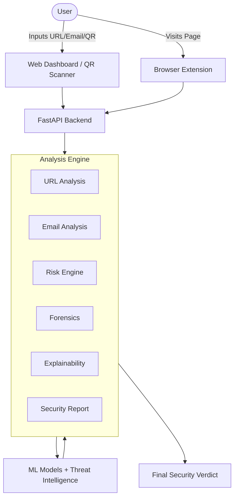

# PhishShield AI – Intelligent Phishing Detection & Security Analysis Platform

## 1. Overview
PhishShield AI is an advanced, multi-layered cybersecurity platform designed to analyze suspicious digital content and identify potential phishing threats with high accuracy and interpretability. The system uses machine learning, deterministic threat intelligence, and forensic analysis to provide actionable insights. It protects users from malicious URLs and emails by aggregating multiple security signals into a unified, explainable risk score.

## 2. Key Features
- **AI/ML-based URL phishing detection**
- **Email phishing detection**
- **URL extraction from emails**
- **Combined email + URL risk analysis**
- **Deterministic risk scoring**
- **Forensic security indicators**
- **Explainable "Why Phishing?" analysis**
- **Unified Security Report**
- **WHOIS intelligence**
- **SSL certificate analysis**
- **Redirect analysis**
- **VirusTotal integration**
- **URL browser extension**
- **QR scanner support**
- **Responsive web dashboard**

## 3. Tech Stack

**Frontend:**
- React, Vite, Vanilla CSS, Axios/fetch

**Backend:**
- Python, FastAPI

**Machine Learning:**
- Scikit-learn, XGBoost, TF-IDF, Linear SVM
- (BiLSTM evaluated experimentally for email analysis)

**Security/Threat Intelligence:**
- WHOIS, SSL/TLS, VirusTotal, redirect analysis

**Browser Extension:**
- Chrome Manifest V3, JavaScript

**Other:**
- HTML/CSS, Git/GitHub

## 4. System Architecture



## 5. URL Phishing Detection
The URL analysis pipeline extracts a comprehensive set of **47 features** from URLs, examining structural, lexical, and network-level properties. The authoritative production model uses an **XGBoost** classifier (`xgboost_frozen.pkl`) to accurately determine the likelihood that a URL is a phishing attempt.

## 6. Email Phishing Detection
The email analysis engine utilizes a **TF-IDF** vectorizer paired with a **Linear SVM** production model to classify email content. It goes beyond simple text analysis by:
- Automatically extracting URLs embedded in the email body.
- Integrating these URLs into the URL analysis pipeline.
- Generating specific forensic indicators from email headers and body.
- Providing explainability to show which terms influenced the model.
- Combining all findings into a unified security report.

## 7. Risk Scoring
PhishShield AI combines machine learning predictions, threat intelligence (like VirusTotal and WHOIS), and deterministic forensic scoring (like invalid SSL or suspicious redirects) into a final, unified risk score. Based on the aggregated severity, the system classifies the input into distinct risk levels:
- **Very Safe**
- **Safe**
- **Suspicious**
- **High Risk**
- **Very High Risk**

## 8. Security Report
The platform outputs a unified `SecurityReport` structure containing detailed evidence categories:
- **ML Evidence:** Confidence scores and raw predictions.
- **Forensic Evidence:** Hard indicators of malicious intent (e.g., hidden iframes, zero-day domains).
- **URL Evidence:** Details extracted directly from the URL.
- **Threat Intelligence:** Data from VirusTotal, WHOIS, and SSL validation.
- **Explainability:** Visual breakdown of the top factors contributing to the final decision.

## 9. Browser Extension
The URL browser extension (Chrome Manifest V3) provides real-time protection:
- Captures active-tab URLs safely.
- Sends URLs to the local FastAPI backend for analysis.
- Displays the prediction, confidence, risk score, risk level, recommendations, and threat signals in a clear pop-up interface.
- Includes safe handling for unsupported browser URLs (like `chrome://` extensions).
- Operates with strict, restricted permissions.

## 10. Project Structure
```text
PhishShieldAI/
├── backend/            # FastAPI, Extractors, Services, Models
├── frontend/           # React, Vite, Dashboard UI
├── extension/          # URL Browser Extension
├── checkpoints/        # Development Phase Tracking
└── README.md
```

## 11. API Endpoints
Key endpoints exposed by the backend:
- `POST /predict`: Analyzes a URL and returns a detailed security report.
- `POST /api/analyze-email`: Analyzes raw email text, extracts URLs, and returns a combined security report.
- `GET /health`: Checks if the backend server is operational.

## 12. ML Performance
Verified metrics from the project's model evaluations:

**URL Model:**
- XGBoost accuracy: ~98.5%
- Random Forest optimized accuracy: ~98.65%

**Email Model:**
- Linear SVM accuracy: ~99.76%
- *Experimental* BiLSTM accuracy: ~99.65%

## 13. Installation & Local Setup

**1. Clone the repository:**
```bash
git clone https://github.com/Dileep0610/PhishShieldAI.git
cd PhishShieldAI
```

**2. Backend Setup:**
```bash
cd backend
python -m venv venv
# On Windows: venv\Scripts\activate
# On Mac/Linux: source venv/bin/activate
pip install -r requirements.txt
```
Set up your `.env` file in the `backend` directory (requires `VT_API_KEY`).
Start the FastAPI server:
```bash
python -m uvicorn app:app --reload
```

**3. Frontend Setup:**
```bash
cd ../frontend
npm install
npm run dev
```
Set up `.env.local` in the `frontend` directory with `VITE_API_BASE_URL=http://localhost:8000`.

**4. Browser Extension Setup:**
- Open Chrome and go to `chrome://extensions/`
- Enable "Developer mode"
- Click "Load unpacked" and select the `extension/` directory.

Ensure both backend and frontend servers are running concurrently.

## 14. Usage
- **Scan a URL**: Enter any URL into the web dashboard's main search bar.
- **Analyze an Email**: Paste email text into the Email Analysis tab to get a comprehensive report.
- **QR Scanner**: Use your camera or upload an image to decode and scan QR codes.
- **Browser Extension**: Click the PhishShield AI icon in your browser toolbar to scan the current webpage.

## 15. Limitations
- The browser extension currently relies on the local backend server (`localhost:8000`) being active to perform scans.
- Threat intelligence features (like VirusTotal) depend on external API availability and limits.

## 16. Future Scope
- **Email Browser Extension**: Integration of email scanning capabilities directly into email client interfaces (e.g., Gmail) via a dedicated extension.
- Cloud deployment and remote API hosting.

## 17. Disclaimer
*PhishShield AI is intended for security analysis, research, and educational purposes. It should not be treated as an absolute guarantee that a website or email is safe or malicious. Always exercise caution and follow standard security practices.*

## 18. Author
**Kothakota Dileep Kumar**  
GitHub: [Dileep0610](https://github.com/Dileep0610)
